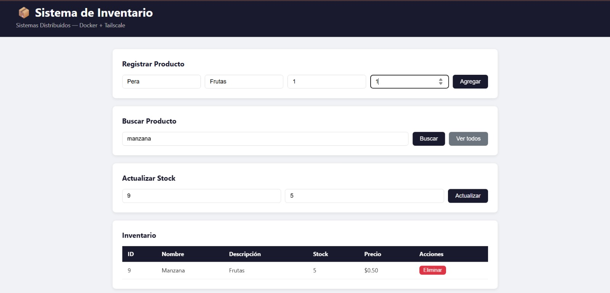
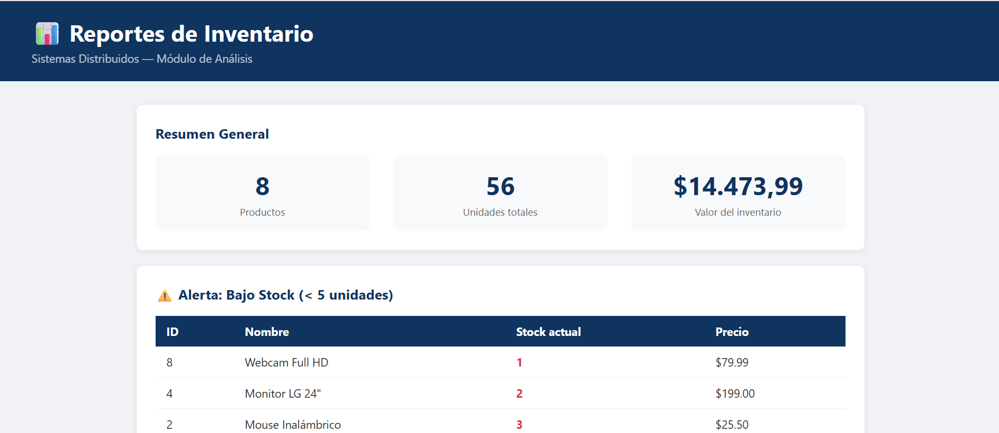
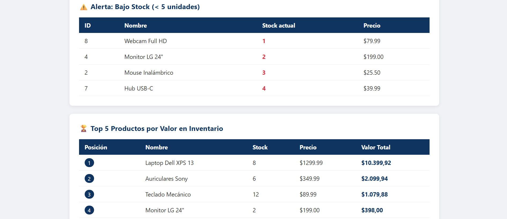
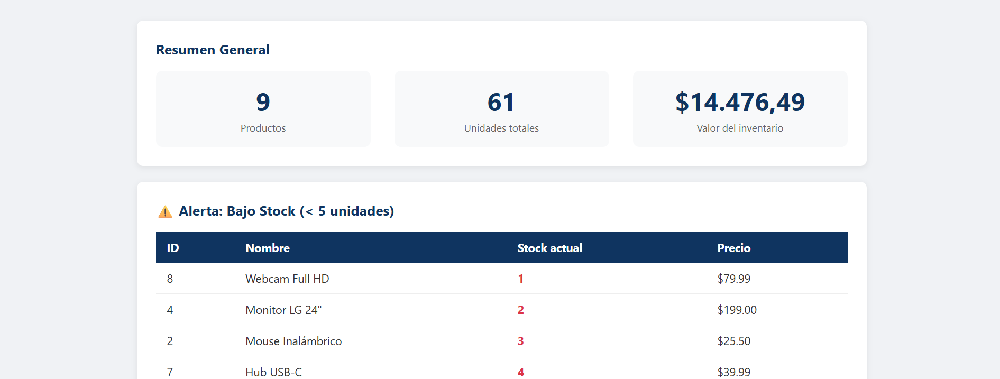
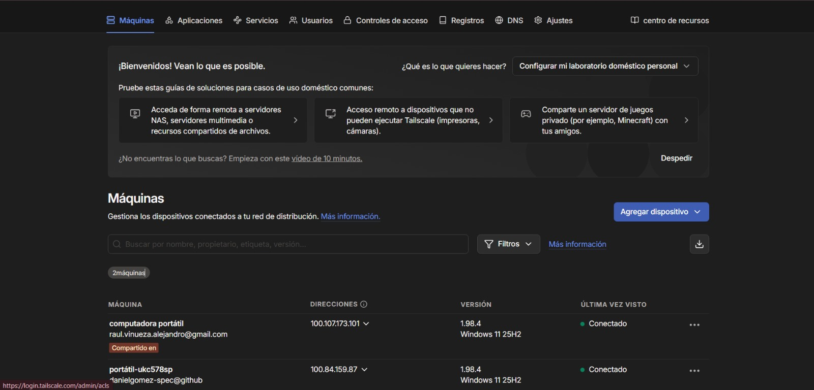
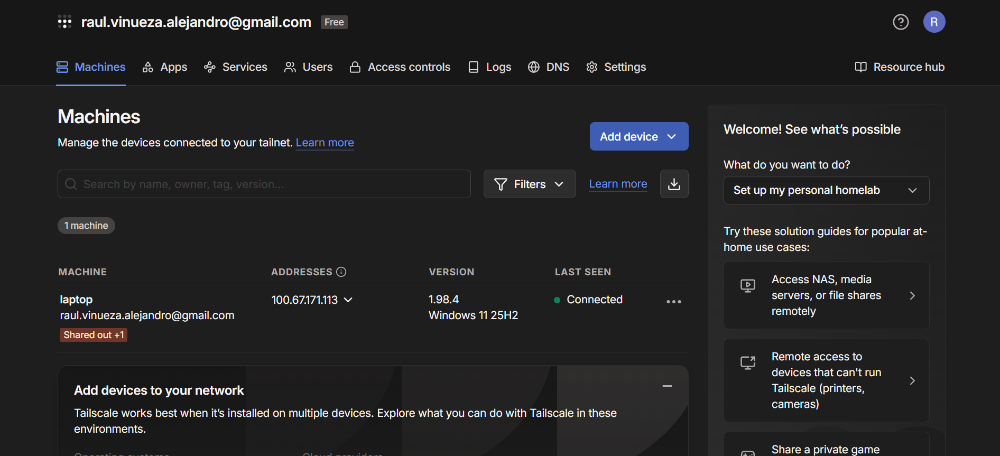

# Sistema de Inventario Distribuido con Docker y Tailscale

Materia: Sistemas Distribuidos | Periodo: 2026-1 | Estado: Completado

## Equipo de trabajo
- [Estudiante 1](https://github.com/danielgomez-spec)
- [Estudiante 2](https://github.com/raulgaray26)

## Capturas / Demo







## Funcionalidad
- [x] Registrar productos (nombre, descripción, cantidad, precio) [Commit](https://github.com/raulgaray26/Inventario-Distribuido-Docker-Tailscale/commit/ac19ebc5faf00b6ecd93b1649d492320e0e4a2b4)
- [x] Actualizar stock de productos existentes [Commit](https://github.com/raulgaray26/Inventario-Distribuido-Docker-Tailscale/commit/ac19ebc5faf00b6ecd93b1649d492320e0e4a2b4)
- [x] Eliminar productos del inventario [Commit](https://github.com/raulgaray26/Inventario-Distribuido-Docker-Tailscale/commit/ac19ebc5faf00b6ecd93b1649d492320e0e4a2b4)
- [x] Listar todos los productos [Commit](https://github.com/raulgaray26/Inventario-Distribuido-Docker-Tailscale/commit/ac19ebc5faf00b6ecd93b1649d492320e0e4a2b4)
- [x] Buscar productos por nombre [Commit](https://github.com/raulgaray26/Inventario-Distribuido-Docker-Tailscale/commit/ac19ebc5faf00b6ecd93b1649d492320e0e4a2b4)
- [x] Reporte: alertas de bajo stock (< 5 unidades) [Commit](https://github.com/raulgaray26/Inventario-Distribuido-Docker-Tailscale/commit/1c470182044af5baf01383e58ce9a8fef17daad3)
- [x] Reporte: top 5 productos por valor en inventario [Commit](https://github.com/raulgaray26/Inventario-Distribuido-Docker-Tailscale/commit/1c470182044af5baf01383e58ce9a8fef17daad3)
- [x] Reporte: resumen general del inventario [Commit](https://github.com/raulgaray26/Inventario-Distribuido-Docker-Tailscale/commit/1c470182044af5baf01383e58ce9a8fef17daad3)
- [x] Persistencia de datos con volumen Docker [Commit](https://github.com/raulgaray26/Inventario-Distribuido-Docker-Tailscale/commit/1c470182044af5baf01383e58ce9a8fef17daad3)

## Tecnologías
`Node.js` | `Express` | `PostgreSQL 15` | `Docker` | `Docker Compose` | `Tailscale`

## Ejecución

### Prerrequisitos
- Docker Desktop instalado
- Tailscale instalado y configurado en ambas máquinas
- Ambas máquinas en la misma red Tailscale

### Estudiante 2 (DB + Reportes) — iniciar primero
```bash
git clone https://github.com/usuario-estudiante1/inventario-distribuido-docker.git
cd inventario-distribuido-docker/db-reportes
# Crear .env con las credenciales (ver .env.example)
docker compose up -d --build
```
Reportes disponibles en: `http://localhost:4000`

### Estudiante 1 (App de Inventario) — iniciar después
```bash
cd app-inventario
# Crear .env con la IP Tailscale del Estudiante 2
docker run -d --name inventario-app --env-file .env -p 3000:3000 app-inventario:v1.0
```
App disponible en: `http://localhost:3000`

## Métricas de Progreso

| Indicador | Valor |
|---|---|
| Commits totales | 14 |
| Issues/PRs fusionados | 3/11 |
| Cobertura de pruebas | N/A |
| Última actualización | 2026-06-14 |

## Reflexión y Aprendizajes

**Habilidades desarrolladas:**
- Contenerización de servicios independientes con Docker
- Comunicación entre contenedores por red interna Docker (nombre de servicio)
- Comunicación entre máquinas físicas a través de VPN privada (Tailscale)
- Separación de responsabilidades en sistemas distribuidos

**Qué funcionó bien:**
- Docker Compose simplificó enormemente la orquestación de los dos contenedores del Estudiante 2
- La red interna Docker eliminó la necesidad de exponer el servicio de reportes al exterior

**Qué se podría mejorar:**
- Implementar autenticación en los endpoints de la API
- Agregar migraciones de base de datos

**Conceptos clave aplicados de la materia:**
- Arquitectura de microservicios distribuidos
- Comunicación entre nodos en diferentes redes
- Persistencia de estado en contenedores efímeros
- Configuración externalizada mediante variables de entorno
